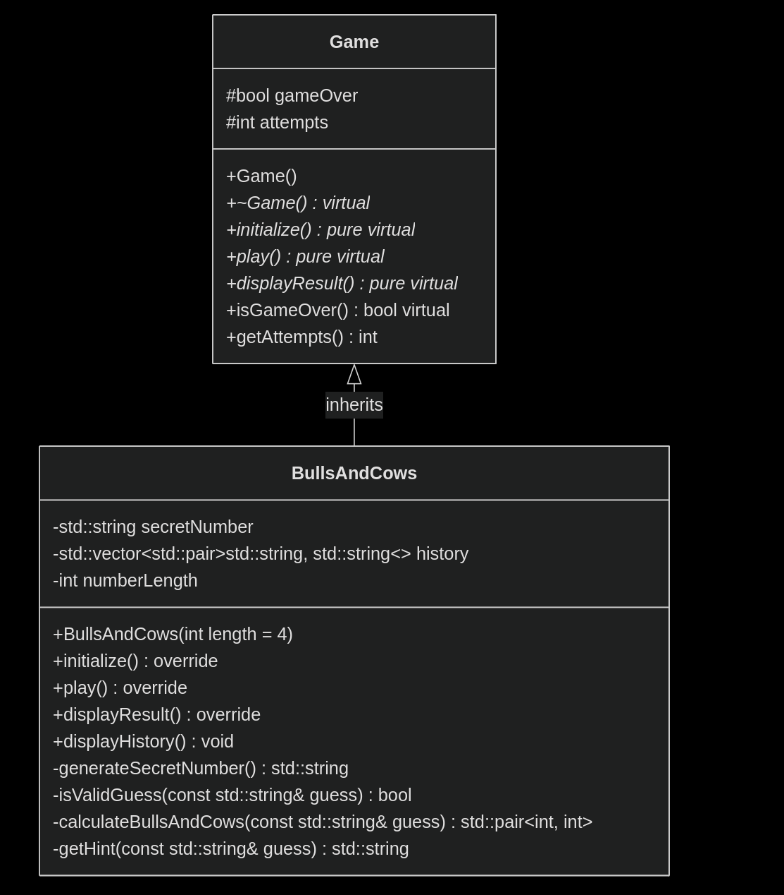

# Bulls and Cows (Быки и Коровы)

Классическая логическая игра на C++ с ООП подходом.

## 🎯 О проекте
- **Быки** - правильные цифры на своих местах
- **Коровы** - правильные цифры не на своих местах
- Задача: угадать число с уникальными цифрами

## 🏗 Архитектура
```
Game (абстрактный класс)
└── BullsAndCows (реализация)
```


## 🚀 Компиляция
```bash
g++ -std=c++11 *.cpp -o bulls_and_cows
```

## 🎮 Функциональность
- Поддержка 4-5 цифр
- История всех попыток
- Проверка корректности ввода
- Подробная статистика игры

## 💡 Особенности
- Чистая ООП архитектура
- Легко расширяется для новых игр
- Русскоязычный интерфейс
